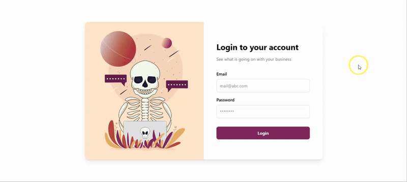

# Authentication App with React & Context API

Aplikasi web sederhana dengan sistem autentikasi menggunakan React, React Router, dan Context API. Dilengkapi dengan form validation menggunakan React Hook Form dan Yup.

## 🚀 Teknologi yang Digunakan

- **React** - Library JavaScript untuk UI
- **React Router DOM** - Routing dan navigasi
- **React Hook Form** - Form management
- **Yup** - Schema validation
- **Tailwind CSS** - Utility-first CSS framework
- **Context API** - State management

## Preview

